# Modelo Entidad Relacion - SistemaEscolarWeb

Este MER representa las entidades principales del sistema escolar web segun los modelos y relaciones usadas por el proyecto.

```mermaid
erDiagram
    ROL {
        int id_rol PK
        string nombre_rol
    }

    PERMISOS {
        int id_permiso PK
        string nombre_permiso
    }

    ROL_PERMISOS {
        int id_rol PK, FK
        int id_permiso PK, FK
        datetime fecha_rol
        bool activo
    }

    PERSONAL {
        string rut_personal PK
        int id_rol FK
        string nombre
        string apellido
        string correo
        string telefono
        string cargo
        string password_legacy
        bool activo
    }

    USUARIO {
        int id_usuario PK
        string rut_personal FK
        int id_rol FK
        string password_hash
        datetime ultimo_acceso
        bool activo
        datetime creado_en
    }

    DEPENDENCIA {
        int id_dependencia PK
        int id_tipodependencia
        string nombre_dependencia
        string responsable_dependencia
    }

    PROVEEDOR {
        int id_proveedor PK
        string nombre_proveedor
        string rut_proveedor
        string correo
        string telefono
    }

    MARCA {
        int id_marca PK
        string nombre_marca
    }

    MODELO {
        int id_modelo PK
        int id_marca FK
        string nombre_modelo
    }

    TIPO_TECNOLOGIA {
        int id_tipotecnologia PK
        string nombre_tipotecnologia
        string descripcion
    }

    ENTRADA_TECNOLOGIA {
        int id_entradatecnologia PK
        int id_proveedor FK
        date fecha_entrada
        int cantidad
        string numero_factura
    }

    TECNOLOGIA {
        int id_tecnologia PK
        int id_modelo FK
        int id_entradatecnologia FK
        int id_tipotecnologia FK
        bool estado
        string sku_codigo_inventario
    }

    ASIGNACIONES {
        int id_asignaciones PK
        int id_tecnologia FK
        int id_dependencia FK "nullable"
        string rut_personal FK "nullable"
        datetime fecha_asignacion
        datetime fecha_devolucion
        string tipo_asignacion
        string estado_asignacion
    }

    REPARACION {
        int id_reparacion PK
        int id_tecnologia FK
        string destino
        datetime fecha_envio
        datetime fecha_retorno
        string detalle
        string estado_reparacion
        string usuario_solicita
        string usuario_aprueba
    }

    DE_BAJA {
        int id_debaja PK
        int id_motivo
        int id_tecnologia FK
        datetime fecha_baja
        string detalle
        string usuario_registra_baja
        string usuario_autoriza_baja
        string estado
    }

    ESTADO_IMPRESION {
        int id_estado_impresion PK
        string estado_impresion
    }

    SOLICITUD_IMPRESION {
        int id_solicitud_impresion PK
        string rut_personal FK
        int id_estado_impresion FK
        datetime fecha_solicitud
        datetime fecha_entrega
        string archivo
        int cantidad_paginas
        int cantidad_copias
        string color
        bool doble_cara
        string detalle
    }

    TIPO_INSUMO {
        int id_tipoinsumo PK
        string nombre_tipoinsumo
    }

    INSUMO {
        int id_insumo PK
        int id_tipoinsumo FK
        string nombre_insumo
        string descripcion_insumo
        string unidad_medida
        bool estado
        string toxicidad
        int stock_actual
        int stock_minimo
    }

    ENTRADA_INSUMO {
        int id_entradainsumo PK
        int id_insumo FK
        int id_proveedor FK
        string numero_factura
        date fecha_entrega
        int cantidad
    }

    SALIDA_INSUMO {
        int id_salidainsumo PK
        int id_insumo FK
        int id_dependencia FK
        string rut_personal FK
        date fecha_salida
        int cantidad
    }

    BITACORAS {
        int IdBitacora PK
        string Usuario
        string Rol
        string Modulo
        string Accion
        datetime Fecha
    }

    ROL ||--o{ PERSONAL : "clasifica"
    ROL ||--o{ USUARIO : "autoriza"
    ROL ||--o{ ROL_PERMISOS : "tiene"
    PERMISOS ||--o{ ROL_PERMISOS : "asignado"

    PERSONAL ||--o| USUARIO : "acceso"
    PERSONAL ||--o{ ASIGNACIONES : "recibe"
    PERSONAL ||--o{ SOLICITUD_IMPRESION : "solicita"
    PERSONAL ||--o{ SALIDA_INSUMO : "responsable"

    DEPENDENCIA ||--o{ ASIGNACIONES : "recibe"
    DEPENDENCIA ||--o{ SALIDA_INSUMO : "destino"

    PROVEEDOR ||--o{ ENTRADA_TECNOLOGIA : "provee"
    PROVEEDOR ||--o{ ENTRADA_INSUMO : "provee"

    MARCA ||--o{ MODELO : "contiene"
    MODELO ||--o{ TECNOLOGIA : "define"
    TIPO_TECNOLOGIA ||--o{ TECNOLOGIA : "clasifica"
    ENTRADA_TECNOLOGIA ||--o{ TECNOLOGIA : "genera"

    TECNOLOGIA ||--o{ ASIGNACIONES : "se_asigna"
    TECNOLOGIA ||--o{ REPARACION : "se_repara"
    TECNOLOGIA ||--o{ DE_BAJA : "se_da_de_baja"

    ESTADO_IMPRESION ||--o{ SOLICITUD_IMPRESION : "estado"

    TIPO_INSUMO ||--o{ INSUMO : "clasifica"
    INSUMO ||--o{ ENTRADA_INSUMO : "ingresa"
    INSUMO ||--o{ SALIDA_INSUMO : "sale"
```

## Reglas relevantes del modelo

- Una `Asignaciones` pertenece siempre a una `Tecnologia`.
- Una `Asignaciones` puede apuntar a `Personal` o a `Dependencia`, pero no a ambos al mismo tiempo.
- `rut_personal` e `id_dependencia` en `Asignaciones` son nullable para permitir esa regla.
- Una `Solicitud_impresion` pertenece a un `Personal` y a un `Estado_impresion`.
- `Solicitud_impresion.cantidad_paginas` y `Solicitud_impresion.cantidad_copias` permiten calcular el total de impresiones.
- `Tecnologia` obtiene su marca por medio de `Modelo`, y su tipo por medio de `Tipo_tecnologia`.
- Los movimientos de insumos se separan en `Entrada_insumo` y `Salida_insumo`.
- `Bitacoras` registra auditoria de acciones del sistema y no depende directamente de una entidad por clave foranea.

